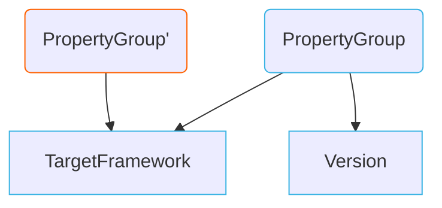
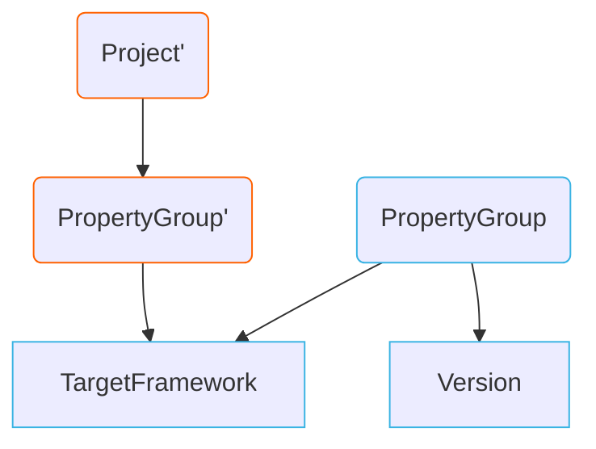
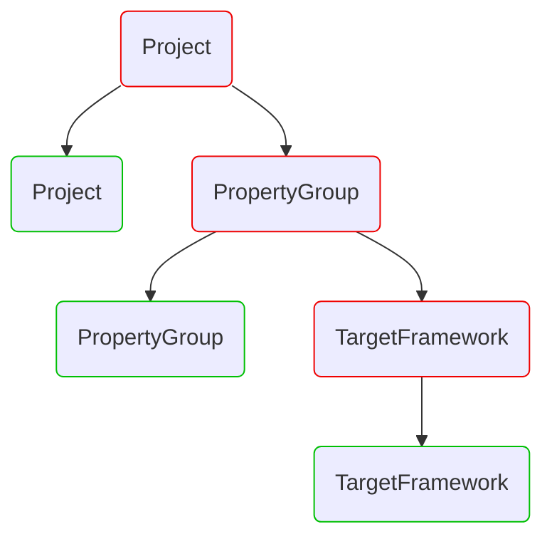
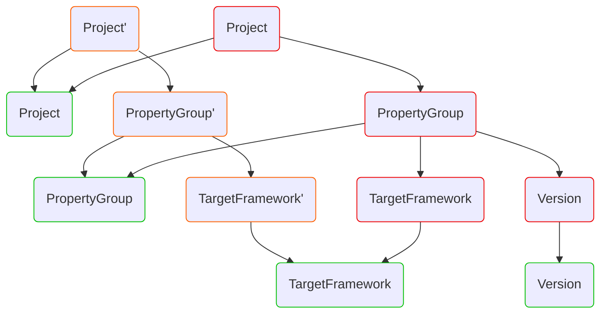
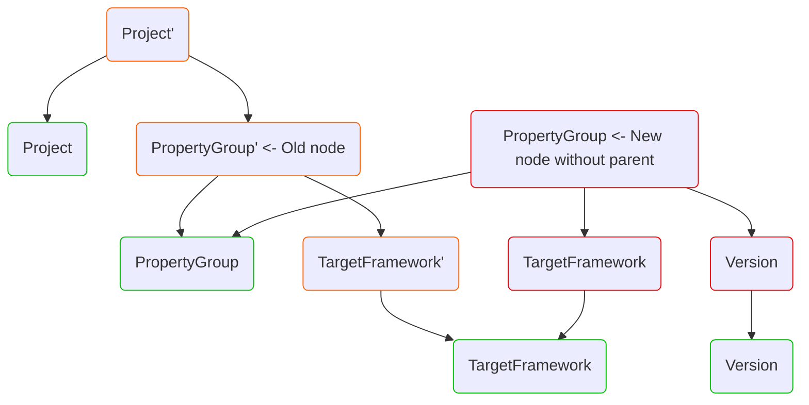

## Постановка задачи
В рамках разработки библиотеки Kysect.DotnetProjectSystem появилась необходимость написать код для чтения и редактирования [[Dotnet project|csproj]] и [[Directory.build.props|props]] файлов. Эти файлы являются XML документами. Примеры ожидаемого функционала:
- Поиск всех PackageReference'ов в проекте
- Замена значений в `<TargetFramework>net8.0</TargetFramework>`
- Добавление значений в PropertyGroup

## GuiLabs.Language.Xml
Формат JSON с мире dotnet является очень распространённым, для него уже создано множество библиотек, его пытаются использовать везде, где получается. Но такого нельзя сказать про XML. Среди множества доступных библиотек для работы с XML выделяется XmlParser, он же GuiLabs.Language.Xml, он же "A Roslyn-inspired full-fidelity XML parser" - [NuGet Gallery | GuiLabs.Language.Xml 1.2.91](https://www.nuget.org/packages/GuiLabs.Language.Xml). Особенность библиотеки в том, что она работает с XML документом, как с  синтаксическим деревом и предоставляет соответствующее API.

Пример кода для поиска ноды с указанием TargetFramework:
```csharp
var original = """
               <Project Sdk="Microsoft.NET.Sdk">
                 <PropertyGroup>
                   <TargetFramework>net8.0</TargetFramework>
                 </PropertyGroup>
               </Project>
               """;

XmlDocumentSyntax root = Parser.ParseText(original);
XmlElementSyntax syntaxToReplace = root
    .Descendants()
    .OfType<XmlElementSyntax>()
    .Single(n => n.Name == "TargetFramework");
SyntaxNode textSyntaxToReplace = syntaxToReplace.Content.Single();
```

Для лучшего ознакомления с тем, что из себя представляет синтаксическое дерево, стоит посмотреть на него в [XmlSyntaxVisualizer](https://xmlsyntaxvisualizer.azurewebsites.net/index.html). Это веб-сервис, который на вход принимает XML строку, а на выходе показывает представление синтаксическими нодами.

## Работа с XML и иммутабельным синтаксическим деревом
Иммутабельные синтаксические деревья имеют свою специфику. Описанные далее проблемы и подходы будут также актуальны для Roslyn деревьев.

Уровень сложности 1: копирование при модификации.
Рассмотрим .props файл с таким содержанием:

```xml
<PropertyGroup>
  <TargetFramework>8.0</TargetFramework>
</PropertyGroup>
```

И поставим задачу - добавить в PropertyGroup значение Version. У XmlElement есть метод AddChild, но для обзора это не так важно и некоторые сигнатуры в дальнейших примерах могут быть упрощены для простоты чтения:

```csharp
var propertyGroupElement = CreateXmlElement(...);
var versionElement = CreateXmlElement(...);
var newPropertyGroupElement = xmlElement.AddChild(versionElement);
```

Метод AddChild не изменяет изначальный элемент, а создаёт новый элемент над которым была выполнена операция:



Уровень сложности 2: изменение вложенных элементов. На самом деле props файл имеет ещё Project ноду и выглядит вот так:
```xml
<Project>
  <PropertyGroup>
    <TargetFramework>8.0</TargetFramework>
  </PropertyGroup>
</Project>
```

И если для такой структуры попытаться найти PropertyGroup и модифицировать, то получится такой результат:


Иными словами, замена не рутового элемента будет возвращать изменённый не рутовый элемент. Но эту задачу берут на себя разработчики библиотек и предоставляют API для модификации дерева, которое позволяет получить изменённое дерево от рута. Вместо модификации определённой ноды используется метод ReplaceNode, который на вход принимает ноду, которую нужно убрать, и новую ноду, которую нужно на место старой добавить:
```csharp
var projectNode = ...;
var propertyGroupElement = projectNode.Find("PropertyGroup");
var versionElement = CreateXmlElement(...);
var newPropertyGroupElement = xmlElement.AddChild(versionElement);
var newProjectNode = projectNode.ReplaceNode(
									propertyGroupElement,
									newPropertyGroupElement); 
```

## Red-Green trees
Уровень сложности 3. Замена нескольких элементов в дереве. Решение проблемы 2 может внушить ложную уверенность в том, что достаточно знать про ReplaceNode и это поможет решить все проблемы. На самом деле выше использованная визуализация является _очень_ сильным упрощением. А реальная реализация подразумевает существования двух деревьев - [[Roslyn Red-green trees|красного и зелёного]]. Про red-green деревья описано в архивах MS Learn - https://learn.microsoft.com/en-us/archive/blogs/ericlippert/persistence-facades-and-roslyns-red-green-trees.

Для понимания проблемы, рассмотрим задачу создания дерева. Дерево состоит из нод, у ноды есть поле для Parent и для Children. Нужно выполнить добавление в ноду ещё одного Chilld:
```
var parent = ...;
var newChild = ...;
newChild.Parent = parent;
parent.AddChild(newChild);
```

Подобный такой код получается у каждого, кто пытается решить эту проблему в лоб. Такая проблема актуальна не только для деревьев, но и для любых задач, где есть элемент, который знает про свои вложенные элементы, а вложенные элементы должны знать про свой контейнер.
Но описанное выше решение строится на одном важном допущении - объекты являются изменяемыми. И это не подходит модели иммутабельных деревьев. Если поставить ограничение на иммутабельность, то эту проблему нормально решить не получится. Это одна из проблем, которая решалась введением red-green деревьев. Идея заключается в том, что создаётся два дерева:
- Зелёное иммутабельное дерево. Оно знает про своё содержимое, длинну, но ничего не знает про parent-child, позицию в дереве
- Красное мутабельное дерев. Оно является фасадом вокруг зелёного

И корректная визуализация дерева до изменений выглядела бы так:


А изменённая:


Возвращаясь к поставленной задаче, рассмотрим пример кода, который всем нодам добавляет атрибут через ReplaceNode:
```xml
<!-- From: -->
<Project>
  <PropertyGroup>
    <TargetFramework>8.0</TargetFramework>
  </PropertyGroup>
</Project>

<!-- To: -->
<Project Checked="true">
  <PropertyGroup Checked="true">
    <TargetFramework Checked="true">8.0</TargetFramework>
  </PropertyGroup>
</Project>
```

```csharp
var projectNode = ...;
var allChildNodes = projectNode.DescendantNodes(...);

foreach (var child in allChildNodes)
{
  var childWithAttribute = child.AddAttribute(...);
  projectNode = projectNode
				  .ReplaceNode(child, childWithAttribute);
}
```

Такое решение будет пытать заменить заранее найденные ноды, но после первой же замены их уже не будет существовать в projectNode, потому что дерево перестроится. Но данная проблема является одной из базовых и для её решения предоставляется стандартный API - это метод ReplaceNodes, который принимает в качестве параметров список нод и Func, который определяет как именно нужно изменять элементы:

```csharp
var projectNode = ...;
var allChildNodes = projectNode.DescendantNodes(...);

projectNode
	.ReplaceNodes(allChildNodes, (_, node) => node.AddAttribute(...));
```


## Использование данных об исходном дереве при модификации
Уровень сложности 4. Библиотека предоставляет API для работы с синтаксическим деревом. Это дополнительный слой абстракции, который позволяет меньше думать об особенностях XML при написании кода. Но стандартных решений из библиотеки оказалось недостаточно, чтобы полностью покрыть требования. К примеру, в библиотеке не был реализован эквивалент NormalizeWhitespace из мира Roslyn'а - [Equivalent of SyntaxNormalizer · Issue #51 · KirillOsenkov/XmlParser (github.com)](https://github.com/KirillOsenkov/XmlParser/issues/51). NormalizeWhitespace - это экстеншен метод для нод, который "применяет форматирование", т.е. добавляет нужные переносы строк и пробелы. Это очень полезно, когда нужно вставить в класс новый метод, чтобы не думать о том, какой отступ для него сделать. Аналогичные ожидания и от XML дерева. Если под PropertyGroup вставляется новая нода, то ожидается, что будет механизм, который добавит также нужные отступы перед нодой.

Для упрощения рассмотрим подзадачу добавления отступов:
```xml
<!-- From: -->
<Project>
<PropertyGroup>
<MyProperty>Value</MyProperty>
</PropertyGroup>
</Project>

<!-- To: -->
<Project>
  <PropertyGroup>
    <MyProperty>Value</MyProperty>
  </PropertyGroup>
</Project>
```

В самой наивной реализации достаточно посчитать вложенность ноды и использовать это значение для подсчёта отступов:
```csharp
var projectNode = ...;
var allChildNodes = projectNode.DescendantNodes(...);

projectNode
	.ReplaceNodes(allChildNodes, (_, node) =>
	{
		var depth = GetNodeDepthIndex(node);
		var newNode = AddSpacesBefore(node, depth);
		return newNode;
	});

int GetNodeDepthIndex(IXmlElement element)
{
	int depth = 0;
	while (element.Parent is not null)
	{
		depth++;
		element = element.Parent;
	}

	return depth;
}
```

Но такое решение нас возвращает к особенностям Red-Green деревьев. Красные деревья являются изменяемыми и модифицируются в процессе добавления. При этом в процессе замены нод ещё не известно окончательный вид дерева. Те ноды, которые модифицируются ничего не знают о parent'ах т.к. они ещё не были переопределены. И описанный выше код будет возвращать null значение для Parent'а нод и код подсчёта будет возвращать 0.
Для решения этой проблемы в методе ReplaceNodes принимается Func с двумя вхоными параметрами. Первая параметр содержит ссылку на ноду, которая была в изначальном дереве до каких-либо изменений, а второй - ссылку на ноду, которая отражает актуальное состояние ноды в процессе замены:



Применяя эти знания можно получить уровень вложенности в исходном дереве:
```csharp
var projectNode = ...;
var allChildNodes = projectNode.DescendantNodes(...);

projectNode
	.ReplaceNodes(allChildNodes, (oldNode, newNode) =>
	{
		var depth = GetNodeDepthIndex(oldNode);
		return AddSpacesBefore(newNode, depth);
	});

int GetNodeDepthIndex(IXmlElement element)
{
	int depth = 0;
	while (element.Parent is not null)
	{
		depth++;
		element = element.Parent;
	}

	return depth;
}
```


## Summary
Библиотека XmlParser очень хорошо подходит для того, чтобы работать с csproj и props файлами за исключением того, что в ней нет форматтера. В проекте https://github.com/kysect/DotnetProjectSystem есть много примеров работы с XML используя синтаксические деревья. Библиотека XmlParser была адаптирована под работу с csproj и props файлами и позволила реализовать все необходимые операции. С поправкой на форматирование. Оно было написано в очень ограниченном варианте. Но это отличный повод изучить, вдохновить и создать PR с добавлением более корректной реализацией в XmlParser.

